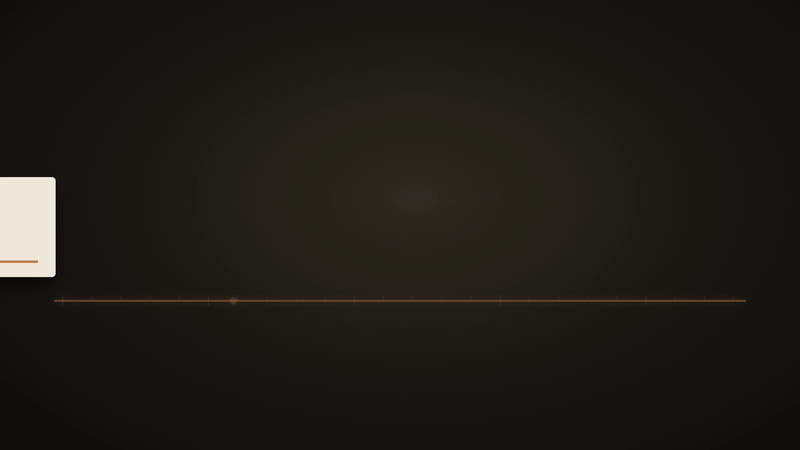
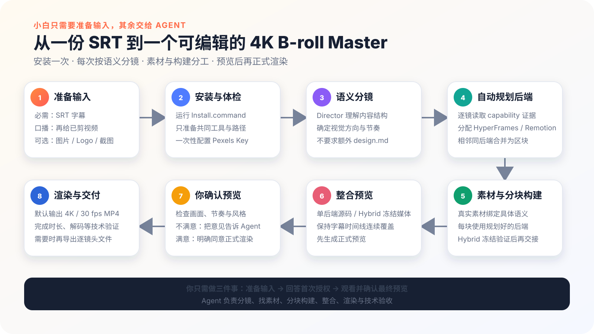

<div align="center">

# Erduo B-roll Loop Engineering

**给一份 SRT，Agent 自动完成原创分镜、素材、动画、预览与最终 Master。**

[](CHANGELOG.md)
[](SUPPORT-MATRIX.md)
[](#支持范围)
[](LICENSE)

**简体中文** · [English](README.en.md) · [日本語](README.ja.md) · [한국어](README.ko.md) · [繁體中文](README.zh-TW.md)

[看成片](#40-秒真实成片) · [看操作](#三步完成) · [安装](#安装) · [真实边界](#真实边界) · [支持范围](#支持范围)

</div>

## 40 秒真实成片

<p align="center">
  
</p>

> README 中是完整成片的轻量 GIF 版。原始 Master 为 3840 × 2160、30 fps、40 秒；它展示真实视觉能力，不代表所有输入都会得到相同画面，也不构成 HyperFrames 与 Remotion 的视觉一致性保证。

## 三步完成

<p align="center">
  
</p>

| 01 一次安装 | 02 一句话开工 | 03 一次批准 |
| --- | --- | --- |
| 安装或升级时完成深度环境检查，以后日常制片只轻检 | 拖入 SRT；口播模式再附已剪视频和品牌素材 | 观看唯一一次完整动态预览，满意后批准正式渲染 |

最短提示词：

```text
使用 erduo-broll-loop-engineering，把这份 SRT 做成 B-roll。
持续执行，直到完整预览需要我批准时再停下。
```

## 它替你完成什么

| 你交给它 | Agent 完成 | 你收到 |
| --- | --- | --- |
| SRT；可选口播视频、Logo、截图和品牌要求 | 原创视觉方向、语义分镜、素材冻结、动画构建、片段验证与脚本拼接 | 可编辑源码、唯一完整预览、验证后的 `master.mp4` |

- 时间严格锚定 SRT，不按“一句字幕配一个镜头”机械切片。
- 默认 `auto`：先完成运行时中立分镜，再按真实能力证据逐镜选择 HyperFrames、Remotion 或 hybrid。
- Director 负责整片表达，Assets 负责素材，多名 Builder 分担镜头；每名 Builder 只接收自己的任务和必要上下文。
- 口播中的观点与情绪变化先转成动画节拍；Builder 必须让主体、空间、层级、关系或视觉重点随节拍产生可见发展，装饰循环不能代替主要动画。
- 运动和构图通过真实逐帧 geometry 代码筛查；通过时不做重复抽帧，异常才定位证据。
- 正常生产不再重复派 Onboarding Agent；只有安装身份变化或真实工具故障才定点诊断。
- 后端规划、任务分发、检查、片段拼接和预览准备由 Parent 直接运行脚本，不再启动 Runtime Planner、Integrator 或 Render Agent。
- 一条生产任务共用素材库与相同依赖；Builder 保持源码隔离，不再复制完整工程和相同素材。
- 每个 Builder 交付可编辑源码和统一规格、已验证的视频片段；脚本拼接视频片段，不假设能够直接理解任意 HyperFrames 或 Remotion 源码。
- 完整预览最高 1080p，使用 `veryfast / CRF 22` 快速生成，并绑定运行计划、全部镜头合同和实际片段身份。
- 用户批准后，交付命令必须重新提供运行计划、整体叙事、视觉系统和全部镜头合同；脚本从冻结片段重新生成完整规格的 `medium / CRF 16` Master，不复制预览文件冒充成片。
- 默认交付 4K、30 fps、H.264 MP4；字幕不重复烧录，背景音乐不自动添加。

输出规格不会让 Parent 手写 JSON。默认规格与竖屏 1080×1920、25 fps
规格都由同一个脚本确定生成：

```bash
node erduo-broll-loop-engineering/scripts/create-production-profile.mjs \
  --output /path/to/broll-production/production-profile.json

node erduo-broll-loop-engineering/scripts/create-production-profile.mjs \
  --output /path/to/vertical-production/production-profile.json \
  --width 1080 --height 1920 --fps 25 \
  --audio silent --master-format h264-mp4
```

父流程必须把生成文件通过 `plan-runtime.mjs --production-profile <文件>`
传入计划。画幅、帧率、音频和输出格式随后以同一个哈希写进计划、每个
Builder 任务和成片校验；明确的竖屏或其他帧率不会退回默认 4K/30。

## v0.9.0：创作保留，重复工作收敛

- 保留 Director、Assets 和多 Builder 的创作分工，不把镜头收缩成固定模板，也不限制抽象、构图或动画复杂度。
- Director 先明确口播含义和画面任务，再自由设计视觉语言，避免风格替代内容表达。
- 非创作步骤交给确定性脚本，共用依赖与素材；Builder 交付可编辑源码和统一规格的已验证视频片段，返工只回到原责任 Builder。
- 节拍验证不仅检查计划和时间，还要检查对应时段是否出现计划中的可见发展；长镜头不能只靠线条、粒子或背景循环支撑。

这些检查能发现计划未落地、长时间无主要发展和可测的构图风险，不能判断动画是否高级或替用户作审美决定。唯一完整动态预览仍由用户决定是否正式渲染。

## 工作流

<p align="center">
  
</p>

```text
SRT / 已剪视频 / 用户素材
  → Director 原创分镜
  → Assets 素材冻结
  → 脚本分配后端和 Builder 任务
  → Builder 交付可编辑源码 + 已验证视频片段
  → 脚本按 SRT 拼接片段
  → 节拍落地 + motion-layout 代码筛查
  → 最高 1080p 完整动态预览
  → 用户批准
  → 从冻结片段重新生成 Master + 完整验证
```

## 152 张 Shotcraft 卡不会限制创作

v0.8.1 已把 Shotcraft 从“逐镜必查菜单”改成真正按需使用的技法辞典：

- Director 必须先独立完成整片创意；
- 只有遇到具名、尚未解决的技法问题，或用户明确要求时才查询；
- 整片 0 次查询、0 个 `patternRef` 是完整有效结果；
- 镜头卡不是素材库，不能代替图片、视频、Logo、UI 或字体；
- **152 张卡片不等于 152 个已经渲染验证的 HyperFrames 组件**。

仓库固定收录 152 张上游 Markdown 卡片、209 个 style 和来源哈希，来源为 [`Vincentwei1021/video-shotcraft`](https://github.com/Vincentwei1021/video-shotcraft)。Agent 只渐进读取真正命中的单张卡，不会把整个卡库塞进上下文。

## 安装

```bash
git clone https://github.com/erduo1998-cell/erduo-broll-loop-engineering.git
cd erduo-broll-loop-engineering
./Install.command
```

安装完成后重启 Codex 或 Claude Code。不会 Git 时，可从绿色 **Code → Download ZIP** 下载，解压到长期保留的目录，再双击 `Install.command`。

> [!IMPORTANT]
> 安装器会让宿主 Skill 指向当前仓库目录。安装成功后不要随意移动或删除它；确需移动时，在新位置重新运行 `Install.command`。

<details>
<summary><strong>安装器具体做什么</strong></summary>

1. 检查 Node.js；低于 `22.20.0` 时准备用户级固定版本，不修改系统 Node 或 shell profile。
2. 安装锁定的 HyperFrames runtime 和官方 Skill，准备浏览器、FFmpeg 与 FFprobe。
3. 以事务方式注册父 Skill 和十三个阶段 Skill；冲突先备份，失败自动回滚。
4. Pexels 只在镜头确实需要普通媒体时配置；Key 不进入聊天、项目和日志。

首次冷安装可能需要 10–20 分钟。网络中断后可直接重跑，已完成的缓存会复用。

</details>

<details>
<summary><strong>更新、诊断与卸载</strong></summary>

```bash
git pull --ff-only
./Install.command
node scripts/doctor.mjs
```

卸载本项目 Skill 链接并恢复安装器备份：

```bash
node scripts/uninstall.mjs
```

卸载默认保留私有配置、共享 HyperFrames runtime 和用户目标目录中的工程。

</details>

## 真实边界

- 现有项目按真实特征判断；同时命中两套后端特征时停止并请用户选择，不静默猜测。
- HyperFrames 与 Remotion Builder 分别完成自己的镜头源码和已验证视频片段；最终由脚本按统一规格和 SRT 时间拼接。
- 安装器不会把 Remotion 加入共享 runtime 或全局安装；每条生产任务使用自己的精确 package/lock，同一依赖身份只在该任务内共享一份本地工具链。
- `hybrid` 只交换带 hash、FFprobe 和完整解码证据的冻结区块媒体，不实时嵌套两套运行时。
- 最终脚本只拼接统一规格、身份和时间均已验证的视频片段；各 Builder 源码继续交付用于后续编辑，但不宣称脚本能直接合并任意双后端源码。
- 预览只用于快速审看：最高 1080p、`veryfast / CRF 22`。批准身份同时绑定运行计划、整体叙事、视觉系统、全部镜头合同和片段 hash。
- 正式交付必须重新传入 `--plan`、`--narrative-envelope`、`--visual-system` 和每一个 `--contract`；合同参数可以任意排列，脚本会按 plan 顺序装配，并拒绝缺失、重复、不属于 plan 或内容改变的合同。身份复核通过后，脚本从冻结片段重新编码完整规格的 `medium / CRF 16` Master，绝不复制预览文件。
- 代码筛查能发现跳变、未 settle、遮挡、裁切、拥挤、层级和运动焦点风险，不能自动证明故事感染力、重量感、弧线、夸张或 appeal。
- 最终完整动态预览仍是唯一默认审美决定；Windows、剪映 / CapCut GUI 和跨后端视觉一致性尚未验证。

详细证据见[支持矩阵](SUPPORT-MATRIX.md)，版本变化见[更新记录](CHANGELOG.md)。

## 支持范围

| 环境 | 状态 |
| --- | --- |
| macOS + Codex | supported；已有真实生产和 423 帧双后端前向证据 |
| macOS + Claude Code | experimental；安装契约已验证，尚缺当前版本同输入完整对照 |
| HyperFrames | 固定官方 runtime 与 Skill |
| Remotion | production-local workflow；不全局安装 |
| Windows | unverified |
| 剪映 / CapCut GUI | unverified |

## 常见问题

<details>
<summary><strong>Codex / Claude Code 找不到 Skill</strong></summary>

彻底重启宿主，再运行 `node scripts/doctor.mjs`；同时确认仓库目录没有被移动或删除。

</details>

<details>
<summary><strong>预览不满意怎么办</strong></summary>

指出镜头、时间点和具体问题。Parent 会把返工交回责任阶段，不会整条片子盲目重做。

</details>

<details>
<summary><strong>可以只用 HyperFrames 或 Remotion 吗</strong></summary>

可以。在提示词中明确写 `hyperframes` 或 `remotion`；未指定时使用默认 `auto`。

</details>

<details>
<summary><strong>可以导出每个镜头吗</strong></summary>

可以。Master 验证通过后说“从已验证 Master 导出逐镜头文件”。

</details>

## 隐私与网络

本仓库自身不采集或发送遥测，子进程默认设置 `HYPERFRAMES_NO_TELEMETRY=1`。首次准备可能访问 Node.js 官方目录、npm registry、GitHub 上的 HyperFrames 官方 Skill 来源，以及 HyperFrames 官方浏览器源执行 `browser ensure`；实际使用 Pexels 时才访问其 API 与 CDN。

SRT、视频、用户素材、阶段记录和渲染产物默认留在本机。Key 不进入项目、产物、命令行或日志。本仓库只能约束自己启动的进程；如果在发行包之外直接调用 HyperFrames，其网络和隐私行为受 HyperFrames 自身实现与政策约束。

完整说明：[隐私](PRIVACY.md) · [安全](SECURITY.md) · [第三方声明](THIRD-PARTY-NOTICES.md)

## 开发与贡献

```bash
npm test
```

提交 PR 前请运行测试和 Skill 校验。不要提交 API Key、Cookie、私人路径、用户 SRT、用户素材或未脱敏日志。贡献规则见 [CONTRIBUTING.md](CONTRIBUTING.md)，项目采用 [MIT License](LICENSE)。

## 联系作者

<table>
  <tr>
    <td width="260" align="center">
      
    </td>
    <td>
      <strong>刘冉 / 耳朵</strong><br><br>
      AI 咨询顾问 · 前影视导演 · 开源 Agent 工具实践者<br><br>
      GitHub：<a href="https://github.com/erduo1998-cell">@erduo1998-cell</a><br>
      主页：<a href="https://erduo.art">erduo.art</a><br>
      微信：扫描左侧二维码
    </td>
  </tr>
</table>

<div align="center">

[English](README.en.md) · [日本語](README.ja.md) · [한국어](README.ko.md) · [繁體中文](README.zh-TW.md)

</div>
